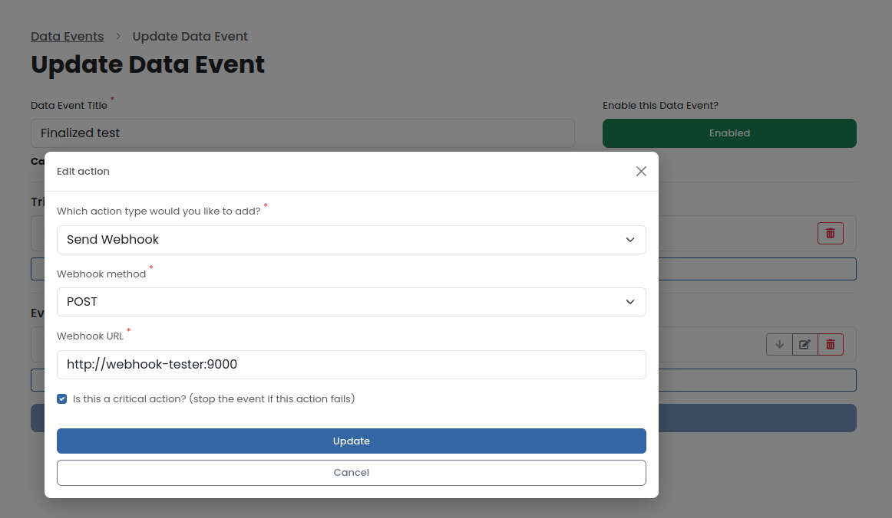
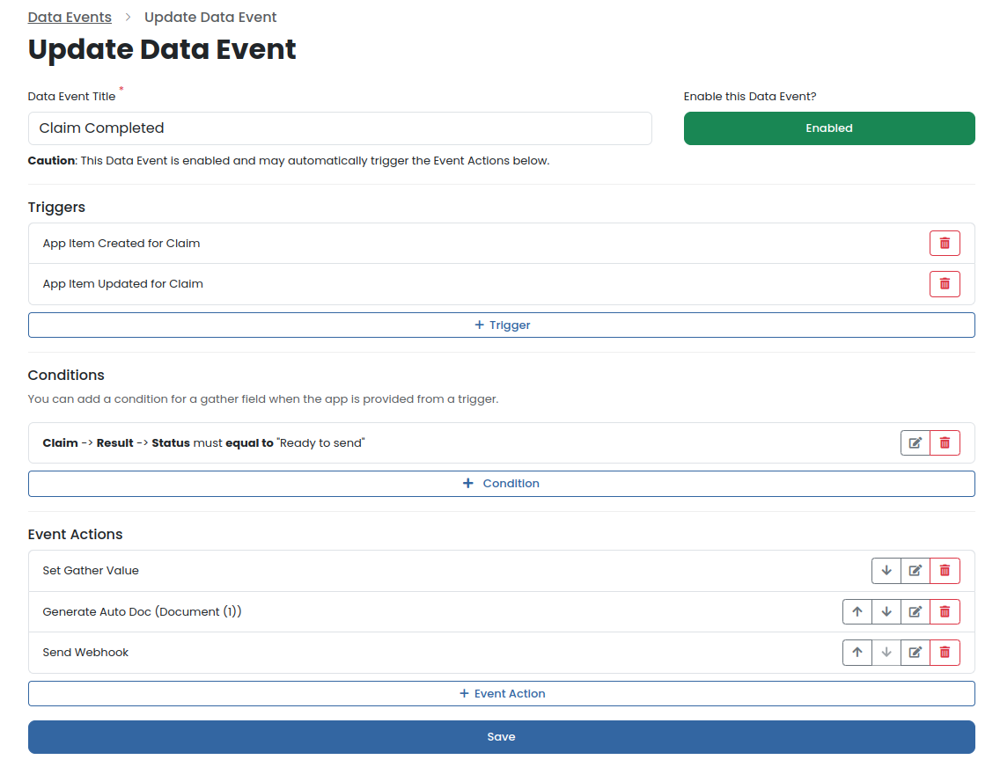
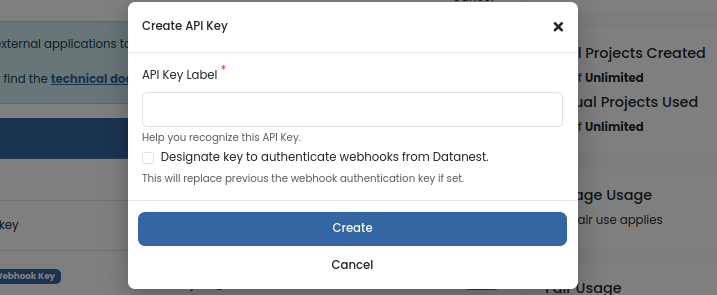

## Data Event Webhooks

In the Datanest Web application, you can configure Data Event "Webhook Actions". These can be triggered by a number of 'Triggers' such as Gather App items (custom form data) being created, modified, a Gather Public Form is submitted, or when an Auto Doc file is marked finalized and more.

You can add a "Send Webhook" Action to a data event to notify an external system of some event that has occurred in Datanest. This can be used to trigger a workflow in another system, or to send data to another system such as a third party API.



You can [learn more about Data Events here](https://app.datanest.earth/support/4). Or [contact us](https://www.datanest.earth/contact-us) to learn more about our customization services.

## Example Data Event



## Webhook Payloads

You can find [TypeScript definitions for the Webhook request payload here](../../src/webhook.ts)

Schema:
```ts
{ 
    event: Event;
    trigger: Trigger;
    project: Project;
    project_link: string;

    // Various exports and artifacts from the Data Event
    artifacts: Artifact[];
    log: Log[];

    // deprecated, use artifacts instead
    item: Item | null;
    file: File | null;
    document: Document | null;
}
```

### Event
```ts
{
    id: number;
    history_id: number;
    label: string;
}
```

### Trigger
```ts
{
    id: number;
    type: number;
    reason: string;
    reason_long: string;
    payload: {
        item_id?: number;
        trigger_type?: number;
        trigger_id?: number;
        event_history_id?: number;
        document_id?: number;
        file_id?: string;
    };
}
```

## Artifact
An artifact is added for each output of a Data Event Action.
E.g. a Figure or Auto Doc is generated as part of a previous action.
Please see the full example output below for more details.
```ts
{
    type: string;
    artifact_label?: string;
    artifact_type?: string;
    action_id?: number;
    action_label?: string;
    app_uuid?: string;
    item_id?: number;
    field_id?: number;
    app_title?: string;
    field_label?: string;
    new_value?: string;
    trigger_id?: number;
    trigger_type?: string;
    recipients?: string[];
    subject?: string;
    body?: string;
    attachments?: Attachment[];
    webhook_url?: string;
    sent_at?: string;
    files?: File[];
    graph_id?: number;
}
```

## Log
A log is added for each step of the Data Event.
Log is an array of arrays with length 3, with the following format:
```ts
[
    0: string, // Log level 
    1: string, // Timestamp
    2: string, // Log Message
]
```

<details>
<summary>Deprecated Payload Data</summary>

### File (Legacy)
```ts
{
    id: string;
    display_name: string;
    path: string;
    size_mb: number;
    link: string;
    temporary_s3_link?: string;
}
```

### Document (Legacy)
```ts
{
    id: number;
    type: number;
    status: number;
    has_been_exported: boolean;
    name: string;
    link: string;
}
```
</details>

## Payload Examples

<details>
<summary>Example 1: Gather App Item Updated or Created</summary>

```json
{
    "event": {
        "id": 5420,
        "history_id": 2622,
        "label": "test"
    },
    "trigger": {
        "id": 5680,
        "type": 2,
        "reason": "App Item Updated",
        "reason_long": "App Item Updated by Brandon De Rose",
        "payload": {
            "item_id": 1337157,
            "trigger_type": 2,
            "trigger_id": 5680,
            "triggered_by_user_id": "5a1359c1-6a87-4862-a613-67ec4d3a2955",
            "event_history_id": 2622
        }
    },
    "project": {
        "uuid": "abfe47e9-741c-4a63-b44c-6347dcbdbe16",
        "project_number": "0101010101010101001",
        "project_name": "STRESS TEST PROJECT",
        "project_client": "TESTING",
        "project_type": 1,
        "project_manager_uuid": "e38b7dcf-8443-47ab-95c8-40db6762d5ae",
        "workflow_id": null,
        "archived": false,
        "is_confidential": false,
        "is_confirmed": true,
        "latitude": -43.5594505,
        "longitude": 172.6868801,
        "storage_needs_calc": true,
        "storage_usage_mb": 0,
        "has_soil_upload": false,
        "has_water_upload": false,
        "has_leachate_upload": false,
        "has_soilgas_upload": false,
        "has_sediment_upload": false,
        "has_xrf_data": false,
        "has_chemical_misalignment": false,
        "has_sample_merging_misalignment": false,
        "has_matrice_misalignment": false,
        "has_unit_misalignment": false,
        "has_rpd_misalignment": false,
        "has_spatial_misalignment": false,
        "is_gather_non_spatial_view": false,
        "is_legacy_gather_table": true,
        "project_address": "15\/24 Broad Street, Woolston, Christchurch, New Zealand",
        "google_place_id": "EjwxNS8yNCBCcm9hZCBTdHJlZXQsIFdvb2xzdG9uLCBDaHJpc3RjaHVyY2ggODAyMywgTmV3IFplYWxhbmQiOBo2CjASLgoUChIJF8YrK3wnMm0RTE0r_2qTXd0QGCoUChIJAxQoK3wnMm0RH5cYn4ue4-kSAjE1",
        "address_street": "24 Broad Street",
        "address_locality": "Broad Street",
        "address_city": "Woolston",
        "address_state": "Canterbury",
        "address_country": "NZ",
        "address_postcode": "8023",
        "measurement_type": "metre",
        "timezone": "UTC",
        "enviro_processed_at": null,
        "updated_at": "2024-07-24T04:25:34.000000Z",
        "created_at": "2024-06-18T22:28:41.000000Z"
    },
    "workflow": null,
    "project_link": "http:\/\/datanest.localhost:8080\/p\/abfe47e9-741c-4a63-b44c-6347dcbdbe16",
    "collection_link": "http:\/\/datanest.localhost:8080\/p\/abfe47e9-741c-4a63-b44c-6347dcbdbe16?redirect=%2Fgather%3Fredirect%3Dcollection",
    "item": {
        "id": 1337157,
        "project_uuid": "abfe47e9-741c-4a63-b44c-6347dcbdbe16",
        "app_uuid": "9f6ce399-84c9-4318-a9d6-70d3f16afe75",
        "type": 3,
        "title": "Soil Logging (TabLogs Enviro)-1",
        "lab_title": null,
        "original_title": null,
        "latitude": -43.5595023,
        "longitude": 172.6868331,
        "sample_type": 3,
        "display_sample_type": "Gather",
        "hidden": false,
        "icon_size": null,
        "label_position": {
            "offsetX": 0,
            "offsetY": 0
        },
        "is_label_hidden": false,
        "label_color": null,
        "label_shadow_color": null,
        "label_size": null,
        "is_label_underlined": false,
        "is_label_asterisk_appended": false,
        "marker_type": 0,
        "enviro_location_code": null,
        "enviro_lab_report_number": null,
        "enviro_start_depth": null,
        "enviro_end_depth": null,
        "enviro_soil_description": null,
        "enviro_lab_sample_type": null,
        "enviro_sampled_date": null,
        "enviro_analyzed_date": null,
        "enviro_duplicate_of_id": null,
        "enviro_triplicate_of_id": null,
        "enviro_composite_of": null,
        "enviro_matrix": "soil",
        "created_at": "2024-06-18T23:05:14.000000Z",
        "updated_at": "2024-06-18T23:10:57.000000Z",
        "deleted_at": null
    },
    "file": null,
    "document": null,
    "artifacts": [
        {
            "type": "trigger",
            "artifact_label": "App Item Updated by Brandon De Rose",
            "trigger_id": 5680,
            "trigger_type": "App Item Updated"
        },
        {
            "type": "action",
            "artifact_type": "Set Gather Value",
            "action_id": 11374,
            "action_label": null,
            "app_uuid": "9f6ce399-84c9-4318-a9d6-70d3f16afe75",
            "item_id": 1337157,
            "field_id": 553327,
            "app_title": "Soil Logging (TabLogs Enviro)",
            "field_label": "Reviewed by",
            "new_value": null
        },
        {
            "type": "action",
            "artifact_type": "Generate Maps Figure",
            "action_id": 11375,
            "action_label": null,
            "files": [
                {
                    "uuid": "9c96651c-a12c-45f6-8b0d-f2a58d47f378",
                    "project_uuid": "abfe47e9-741c-4a63-b44c-6347dcbdbe16",
                    "display_name": "Figure 1. Untitled Figure.png",
                    "path": "Figures",
                    "size_mb": 0.24438190460205,
                    "version": 18,
                    "is_final": false,
                    "virus_status": 1,
                    "review_status": 0,
                    "review_comments": null,
                    "formatter_comments": null,
                    "created_at": "2024-07-23T01:19:14.000000Z",
                    "updated_at": "2024-07-24T04:33:46.000000Z",
                    "deleted_at": null
                }
            ]
        },
        {
            "type": "action",
            "artifact_type": "Send Email",
            "action_id": 11376,
            "action_label": null,
            "recipients": [
                "bob@smith.com"
            ],
            "subject": "Data Event App Item Updated",
            "body": "Soil Logging (TabLogs Enviro) was App Item Updated by Brandon De Rose with reference Soil Logging (TabLogs Enviro)-1",
            "attachments": [
                {
                    "id": "2xqkrcm",
                    "file": {
                        "id": "9c96651c-a12c-45f6-8b0d-f2a58d47f378",
                        "path": "Figures",
                        "context": null,
                        "s3_file": "files\/5e2910e0100e8\/19686\/Figures\/Figure 1. Untitled Figure_58107.png",
                        "size_mb": 0.24356460571289,
                        "version": 3,
                        "is_final": false,
                        "created_at": "2024-07-23T01:19:14.000000Z",
                        "deleted_at": null,
                        "expires_at": null,
                        "is_pending": false,
                        "project_id": 19686,
                        "updated_at": "2024-07-23T01:20:54.000000Z",
                        "document_id": null,
                        "display_name": "Figure 1. Untitled Figure.png",
                        "virus_status": 1,
                        "review_status": 0,
                        "review_comments": null,
                        "comments_file_id": null,
                        "uploader_user_id": null,
                        "formatter_comments": null
                    },
                    "name": "Figure 1. Untitled Figure.png",
                    "type": "File",
                    "file_id": "9c96651c-a12c-45f6-8b0d-f2a58d47f378",
                    "figure_id": null,
                    "document_id": null,
                    "convert_to_pdf": false,
                    "auto_doc_options": null
                }
            ]
        },
        {
            "type": "action",
            "artifact_type": "Send Webhook",
            "action_id": 11377,
            "action_label": null,
            "webhook_url": "https:\/\/webhook.site\/70d82285-9c73-4820-8fba-048971fed129",
            "sent_at": "2024-07-24T04:33:49.826622Z"
        },
        {
            "type": "action",
            "artifact_type": "Generate Maps Figure",
            "action_id": 11378,
            "action_label": null,
            "files": [
                {
                    "uuid": "9c98a185-5ef6-4775-8667-5458cd3f38e2",
                    "project_uuid": "abfe47e9-741c-4a63-b44c-6347dcbdbe16",
                    "display_name": "Figure Basemap Figure.png",
                    "path": "Figures",
                    "size_mb": 0.12800884246826,
                    "version": 6,
                    "is_final": false,
                    "virus_status": 1,
                    "review_status": 0,
                    "review_comments": null,
                    "formatter_comments": null,
                    "created_at": "2024-07-24T03:59:48.000000Z",
                    "updated_at": "2024-07-24T04:34:03.000000Z",
                    "deleted_at": null
                }
            ]
        },
        {
            "type": "action",
            "artifact_type": "Generate Insights Graph",
            "action_id": 11379,
            "action_label": null,
            "files": [
                {
                    "uuid": "9c9665d9-e113-4747-93bc-c30ce83c6f98",
                    "project_uuid": "abfe47e9-741c-4a63-b44c-6347dcbdbe16",
                    "display_name": "Untitled 745 - 1 - 1.png",
                    "path": "Data Insights\/Untitled 745",
                    "size_mb": 0.004267692565918,
                    "version": 27,
                    "is_final": false,
                    "virus_status": 1,
                    "review_status": 0,
                    "review_comments": null,
                    "formatter_comments": null,
                    "created_at": "2024-07-23T01:21:18.000000Z",
                    "updated_at": "2024-07-24T04:34:10.000000Z",
                    "deleted_at": null
                }
            ],
            "graph_id": 745
        }
    ],
    "log": [
        [
            "INFO",
            "2024-07-24T04:33:32.539534Z",
            "Event started. Trigger: App Item Updated by Brandon De Rose"
        ],
        [
            "INFO",
            "2024-07-24T04:33:32.544858Z",
            "All Conditions passed!"
        ],
        [
            "INFO",
            "2024-07-24T04:33:32.553760Z",
            "Set Gather Value for Reviewed by to \"NULL\""
        ],
        [
            "INFO",
            "2024-07-24T04:33:32.555614Z",
            "Starting Figure generation..."
        ],
        [
            "INFO",
            "2024-07-24T04:33:48.599407Z",
            "Generated Figure: Figure 1. Untitled Figure.png taking 16.04 seconds."
        ],
        [
            "INFO",
            "2024-07-24T04:33:48.601236Z",
            "Starting Email action..."
        ],
        [
            "INFO",
            "2024-07-24T04:33:48.601358Z",
            "Sending email to bob@smith.com"
        ],
        [
            "INFO",
            "2024-07-24T04:33:48.666253Z",
            "Attaching File: Figure 1. Untitled Figure.png"
        ],
        [
            "INFO",
            "2024-07-24T04:33:48.666631Z",
            "Sending email with subject: Data Event App Item Updated"
        ],
        [
            "INFO",
            "2024-07-24T04:33:50.856276Z",
            "Successfully sent POST Webhook to https:\/\/webhook.site\/..."
        ],
        [
            "INFO",
            "2024-07-24T04:33:50.858485Z",
            "Starting Figure generation..."
        ],
        [
            "INFO",
            "2024-07-24T04:34:05.892166Z",
            "Generated Figure: Figure Basemap Figure.png taking 15.03 seconds."
        ],
        [
            "INFO",
            "2024-07-24T04:34:05.893100Z",
            "Starting Insights Graph generation..."
        ],
        [
            "INFO",
            "2024-07-24T04:34:11.904622Z",
            "Generated Insights Graphs successfully"
        ]
    ]
}
```
</details>

<!-- <details>
<summary>Example 2: Document Finalized</summary>

When a `file` is provided, there will be `temporary_s3_link` with a 10 minute expiration to download the file.
The file, document and project `link`s are for the Datanest web application intended for end-users.

```json
{
    "event": {
        "id": 39,
        "history_id": 342,
        "label": "Finalized test"
    },
    "trigger": {
        "id": 143,
        "type": 6,
        "reason": "Auto Doc Finalized",
        "reason_long": "Auto Doc Finalized",
        "payload": {
            "trigger_id": 143,
            "trigger_type": 6,
            "document_id": 5113,
            "file_id": "9b2e7091-22bc-4a25-b9d7-d6701a50387a",
            "event_history_id": 342
        }
    },
    "project": {
        "uuid": "005056a4-ecd7-4ded-87bc-dad952efe1a5",
        "project_number": "Data Event Webhooks",
        "project_name": "Sopoline Burton",
        "project_client": "Tempor do aliquid no",
        "project_type": 1,
        "project_manager_uuid": "b4d84c46-1513-42ac-9d9f-dd56fa3d853c",
        "archived": false,
        "is_confidential": false,
        "is_confirmed": true,
        "latitude": 40.7094756,
        "longitude": -74.0072955,
        "storage_needs_calc": true,
        "storage_usage_mb": 0,
        "has_soil_upload": false,
        "has_water_upload": false,
        "has_leachate_upload": false,
        "has_soilgas_upload": false,
        "has_xrf_data": false,
        "has_chemical_misalignment": false,
        "has_sample_merging_misalignment": false,
        "has_matrice_misalignment": false,
        "has_unit_misalignment": false,
        "has_rpd_misalignment": false,
        "has_spatial_misalignment": false,
        "is_gather_non_spatial_view": false,
        "is_legacy_gather_table": true,
        "project_address": "123 William Street, New York, NY, USA",
        "google_place_id": "ChIJIaGbBBhawokRUmbgNsUmr-s",
        "address_street": "123 William Street",
        "address_locality": "Manhattan",
        "address_city": "New York",
        "address_state": "New York",
        "address_country": "United States",
        "address_postcode": "10038",
        "measurement_type": "inch",
        "timezone": "America\/Los_Angeles",
        "enviro_processed_at": null,
        "updated_at": "2024-01-26T02:49:45.000000Z",
        "created_at": "2024-01-24T03:48:57.000000Z"
    },
    "project_link": "http:\/\/datanest.localhost:8080\/p\/005056a4-ecd7-4ded-87bc-dad952efe1a5",
    "item": null,
    "file": {
        "id": "9b2e7091-22bc-4a25-b9d7-d6701a50387a",
        "display_name": "Data Event Webhooks - Document (1) - Claim-6 - #013.docx",
        "path": "Auto Docs\/Document (1)",
        "size_mb": 0.028589248657227,
        "link": "http:\/\/datanest.localhost:8080\/p\/005056a4-ecd7-4ded-87bc-dad952efe1a5?redirect=%2Ffile%2F9b2e7091-22bc-4a25-b9d7-d6701a50387a",
        "temporary_s3_link": "https:\/\/datanest-staging.s3.ap-southeast-2.amazonaws.com\/files\/...(ommitted)"
    },
    "document": {
        "id": 5113,
        "type": 0,
        "status": 0,
        "has_been_exported": true,
        "name": "Document (1)",
        "link": "http:\/\/datanest.localhost:8080\/p\/005056a4-ecd7-4ded-87bc-dad952efe1a5?redirect=%2Fdeliver%2Fword%2Feditor%2F5113"
    }
}
```
</details> -->

## Tools for testing Webhooks

#### Webhook.site
You can test your Webhook URL by using a service like [Webhook.site](https://webhook.site) (not affiliated) to see the payload sent by Datanest.

#### Ngrok
You may want to use Ngrok to expose your local server to the internet for testing webhooks. [See Ngrok Getting Started](https://ngrok.com/docs/getting-started/)

e.g. `ngrok http http://localhost:8080`

This will expose your local server to the internet and provide a public URL like `https://12345678.ngrok.io` which can be used to receive webhooks from Datanest.

## More Information

You can retrieve more information about the project, item, or file by using the provided `uuid` or `id` in the payload.

### Project REST API
[See Projects API](../endpoints/projects.md)

### Gather Item REST API
[See Gather API](../endpoints/gather.md)

## Downloading Files

When a `file` object is provided in the payload, there will be `temporary_s3_link` with a 10 minute expiration to download the file.

## Tips to prevent infinite loops

You can use Data Event Conditions to check, for example, a dropdown is set to "Ready for Review". The first action could be a "Set Gather Value" to set the dropdown to "Sent for Review", before the second action could be a "Send Email" action. This would prevent the email from being sent twice, especially if someone is making rapid changes during data collection. For the user to resend the email they can manually set it back to "Ready for Review" for the Data Event to trigger again.


## Webhook Authentication

Your Webhook receiving system should verify the X-Signature header for best security practice, ensuring requests have actually come from Datanest. You can authenticate the webhooks sent by Datanest by setting up an API key in the Datanest web application under `Company Settings > API Keys` and designating the key to be used for webhook authentication.



There will only ever be one webhook designated API Key per company. Designating a new key will automatically revoke the previous key as the webhook designated key.


#### Headers

Once set, the webhook will contain the following headers for authentication:

- `X-API-Key`
- `X-Timestamp`
- `X-Signature`

#### X-Signature Hash Details

- **Hash Format**: SHA256 HMAC
- **Hash Key**: API Secret Key
- **Hash Payload**: `<url>:<method>:<body>:<X-Timestamp>`

#### Verification

You can verify the webhook by hashing the payload with SHA256 using the API Secret Key and comparing it to the `X-Signature` header.

The `X-Timestamp` header is used to prevent replay attacks. You can check the timestamp is within a reasonable time frame, e.g. +/- 60 seconds.

#### Implementation Example

Please refer to [src/webhook.ts](../../src/webhook.ts) > [authenticateWebhook](https://github.com/search?q=repo%3Adatanest-earth%2Fdatanest-nodejs-client%20authenticateWebhook&type=code) function for an auth verification implementation example.
