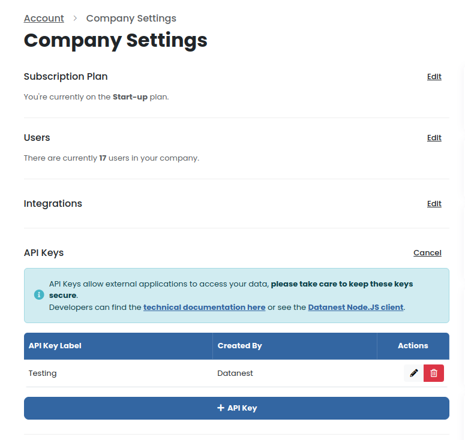

# Datanest API Client for Node.js

Please see the [Datanest API documentation](docs/readme.md) for more information.

This is a Node JS implementation of [datanest.earth](https://datanest.earth)'s REST API client.
You should use this lightweight package to easily start using the API.

**If you are not using Node.js** you can use this package as [an implementation example](https://github.com/search?q=repo%3Adatanest-earth%2Fdatanest-nodejs-client+DatanestClient&type=code). Or see the [API documentation](docs/readme.md) for more information.

If you need help please contact [hello@datanest.earth](mailto:hello@datanest.earth) for technical support.

## Obtaining API Keys

Your Datanest Account Manager can generate API keys, from the Company Management page, API Keys section.
<details>
<summary>Show Screenshot</summary>



</details>

## Requirements

If you wish to use this Node package, you will need to have Node installed on your machine.
This package should work with both Bun and Deno runtime alternatives (unverified)

We recommend the latest stable version of Node.
- Tested on Node v20.8.0

<details>
<summary>Minimum requirements</summary>

- Fetch API is required, available in Node v18.0+ (unverified)
> [node-fetch](https://www.npmjs.com/package/node-fetch) may allow for earlier versions

</details>

## Installation for Node projects

Install from NPM using your preferred package manager.

```bash
npm install --save @datanest-earth/nodejs-client
```
<details>
<summary>Alternatives</summary>

```bash
pnpm add @datanest-earth/nodejs-client
```
```bash
bun add @datanest-earth/nodejs-client
```
</details>


## Authentication

Datanest's API uses API keys to authenticate requests along with a HMAC signature [(see docs)](./docs/readme.md) [(see implementation example.)](https://github.com/search?q=repo%3Adatanest-earth/datanest-nodejs-client%20signRequest&type=code) The signature may be tricky to implement, so we recommend using this package to get started.

## Getting Started

The client will automatically look for a local `.env` file to get the API key and secret.

Place your API key in a .env
```env
DATANEST_API_KEY=your-api-key
DATANEST_API_SECRET=your-api-secret
```

Simply instantiate `DatanestClient`
```js
import DatanestClient from '@datanest-earth/nodejs-client';
import dotenv from 'dotenv';

// Load .env
dotenv.config();

const client = new DatanestClient();
```

<details>
<summary>Alternatively use the constructor to pass the API key and secret.</summary>


```js
import DatanestClient from '@datanest-earth/nodejs-client';

const client = new DatanestClient('your-api-key', 'your-api-secret');
```
</details>

### Make GET, POST, PATCH, PUT, DELETE requests

The client exposes the following methods to make requests to the API.

```ts
client.get(path, params?: Record<string, any>, optionalFetchOptions);
client.post(path, params?: Record<string, any>, optionalFetchOptions);
client.patch(path, params?: Record<string, any>, optionalFetchOptions);
client.put(path, params?: Record<string, any>, optionalFetchOptions);
client.delete(path, params?: Record<string, any>, optionalFetchOptions);
```

The underlying Fetch API is used, you can pass in any valid Fetch options as the third argument. For example, to add a custom header.

See [Fetch API "options" docs](https://developer.mozilla.org/en-US/docs/Web/API/fetch#options)

<details>
<summary>Example</summary>

```ts
import DatanestClient from '@datanest-earth/nodejs-client';
import dotenv from 'dotenv';

// Load .env
dotenv.config();

async function listProjects() {
    const client = new DatanestClient();
    client.setClientId("Company A Version 1");
    const response = await client.get('v1/projects');
    const projects = await response.json();
    console.log(projects);
}

listProjects();
```
</details>

## API Endpoints and Types

This package includes endpoints with type definitions.

Function & Type Definitions:
- [Projects API](https://tsdocs.dev/docs/@datanest-earth/nodejs-client/0.2.5/modules/projects.html)
- [Gather API](https://tsdocs.dev/docs/@datanest-earth/nodejs-client/0.2.5/modules/gather.html)
- [Integrations API](https://tsdocs.dev/docs/@datanest-earth/nodejs-client/0.2.5/modules/integrations.html)

You can also see the [TypeScript source code](./src/)

## Postman

See the [Postman Collection](docs/postman/readme.md)

## Testing

You can override the default API endpoint by setting the `DATANEST_API_BASE_URL` environment variable.

```env
DATANEST_API_BASE_URL=https://app.datanest.earth/api
```

<details>
<summary>Alternatively, you may set the base url from your code</summary>

```ts
import DatanestClient from '@datanest-earth/nodejs-client';

const client = new DatanestClient();
client.setBaseUrl('https://app.datanest.earth/api');
```
</details>
